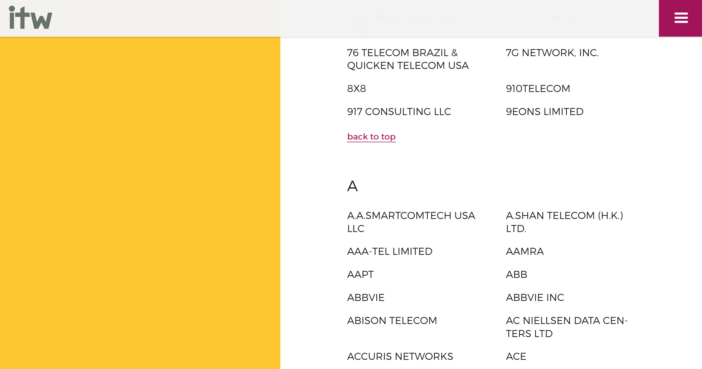

Title: Crawling dynamically generated content with Scrapy 
Date: 2017-11-21
Category: Tutorial
Tags: scrapy, python
Summary: Learn how to use the *scrapy shell* to assess why your spider does not return anything or if you need to change your spider.
Status: published

[One](https://stackoverflow.com/questions/33185651/python-scrapy-for-dynamic-content) [of](https://stackoverflow.com/questions/27525142/selenium-ajax-dynamic-pagination-base-spider) [the](https://stackoverflow.com/questions/44110505/no-data-after-scraping-a-website) [most](https://stackoverflow.com/questions/41165599/how-to-get-the-href-and-associated-information-using-scrapy) [frequent](https://www.reddit.com/r/learnpython/comments/6ij1qa/trying_to_get_a_url_using_bs4_but_source_code_is/) questions I have encountered concerning Scrapy is how to crawl dynamic pages. People may learn about Scrapy because their goal is to crawl a particular page, but then fail to understand why their Spider returns only empty outputs. 

You may have run into this problem. Odds are, since you are reading this, you may have this problem right now.
Frequently people will resort to Selenium or Splash or whatever, to simulate a browser in order to crawl a dynamic webpage. In my opinion the likes of Selenium can be overkill for many crawling-tasks, especially if your goal is only to crawl a dynamic webpage. Scrapy is well capable of crawling dynamic pages and by learning how to do it, you will gain many important skills that will help you analyze websites and build better spiders. 

# What you will learn

In this article I will go into the following skills:

* Learning how to use the scrapy shell to assess a website
* Learning how to identify requests that are made on a website
* Learning how to duplicate the necessary requests in your spider

So let's dive right in with the first question you will likely as yourself, when confronted with a dynamic webpage...

# 1. Why does my Spider not return anything? 

I had just learned about Scrapy because a project at work would have needed, well, Webscraping. After researching and weighing countless options, I finally found this little library written in Python. Getting it up and running was fairly easy, using small websites with a rather limited complexity. Eagerly, I jumped into the real project, crawling a web-shop in order to compare prices. After having set up the spider and running it, I found out to my dismay that my trusted csv-file was populated by... 

Nothing. 

Cue multiple code-reviews, hours of reading and dozens of curses. My spider seemed to be correct. I must have missed something. If you read the linked questions in the beginning, you might have seen that many people people have a completed spider, that is basically correct, but not for this task. So how do we know if we are dealing with a dynamic webpage? 

### Use the shell!

The Scrapy shell is a wholly powerful tool, a must for beginners and... wholly underutilized. Beginners start by putting together complex spiders for hours on end only to realize that the spider they have coded is completely unfit for the task at hand. Again, I did too. 

*Dont believe anyone who tells you that he will quickly code something! [Source](https://xkcd.com/1319/)*

You can fire up the Scrapy shell as follows:

    > scrapy shell http://www.example.com

Which should greet you with a whole lot of text and a command prompt. What the shell does is basically create a spider for you on the given website that allows you to control it on the fly. The complete spider you programmed (that may have returned nothing) is like a self-driving car: You program the destination and the route into the GPS and off goes the car. 

The shell is like sitting in the car, being able to accelerate, brake, turn and so on. 

In the shell you are able to: 

* Extract contents from a page
* Fetch, i.e. crawl other pages
* Fill out forms, login, call functions, etc.

In short, anything you can do in your spider, you can do in the shell. Note, this doesn't mean that you *should* do anything you can do in you spider in the shell. The shell is used primarily for testing and debugging purposes. 

### 1.1 Using the shell to analyze website-content

So let's try to use the shell in a real setting with a page we could crawl. Let's take the [International Telecoms Week](https://www.internationaltelecomsweek.com), which is an "annual meeting for the global wholesale telecoms industry" ([Source](https://www.internationaltelecomsweek.com/about-itw)).
Imagine we would like to crawl the companies attending ITW 2018, which can be looked up [here](https://www.internationaltelecomsweek.com/this-year/companies-attending). If you look at the website you will see that, neat, all the companies are listed on this page. You can scroll through the whole page, without having to worry about pagination or something like that. 

*Example of the list of companies attending ITW 2018.*

Before we'll even try to get the data, i.e. the attending companies via *xpaths* or *css*, we will look at how the site *looks to our Spider*. For this the shell has a neat little command that let's you view the current response sent to the spider directly in your browser. 

    > scrapy shell 'https://www.internationaltelecomsweek.com/this-year/companies-attending'
    > view(response)

Your browser should now show you the website as we have seen it before, but as you will see, there is a crucial part that is missing: The actual companies! 

*Oh god, where are my companies?*

And this is exactly why the shell is so helpful when starting out with crawling or even at the beginning of a crawling-project: Instead of spending hours of coding a rough outline of our spider, checking and re-checking the correct *xpaths*, verifying that the spider seems to be correct, digging through Stackoverflow-questions, we have been able to identify with two basics commands, that our spider will indeed be a little more complex than what we would have done otherwise. 

I know I am repeating myself here but **use the shell**! At the start of almost every crawling-project I start out in the shell. Check which *xpaths* could be helpful, provide the expected results, are even accessible. If the spider has to visit multiple pages, I also like to plan a rough outline of the path the spider can take. So if your spider is not delivering the expected results, check the shell! 

Now that we have identified and caught our problems early, how do we go on about the companies and this dynamic site? 

# 2. How can I be more dynamic? 

In order to understand how we can extract the companies from the ITW-site, we will first have to understand what happens in our browsers when we access the site. 

## 2.1 Static vs. dynamic sites

Since you have an interest in webcrawling, you probably have heard of HTML, requests and responses, and the term *dynamic website*, besides in this post. So what exactly is the difference between a static and a dynamic site? 

The most simple explanation I have read over the years is: If you can print out the website and not lose any functionality, it's most a static site. Of course you would not be able to click any links, but still. Take this blog for example. Every page here is generated from a simple *markdown*-file, e.g. `Crawling.md` and then stylized through a theme, all thanks to the great [Pelican](https://blog.getpelican.com/). There is nothing fancy here, you can't filter, you can't hide images in this post. All it is is images, text and a little styling. 

So the key difference between a static and a dynamic site is *scripting*. If there is any scripting occuring on the site, this part of the site is dynamic. 

## 2.2 Getting the companies from ITW

So with this quick overview over static vs. dynamic sites, let's take a look at the IWF site.
