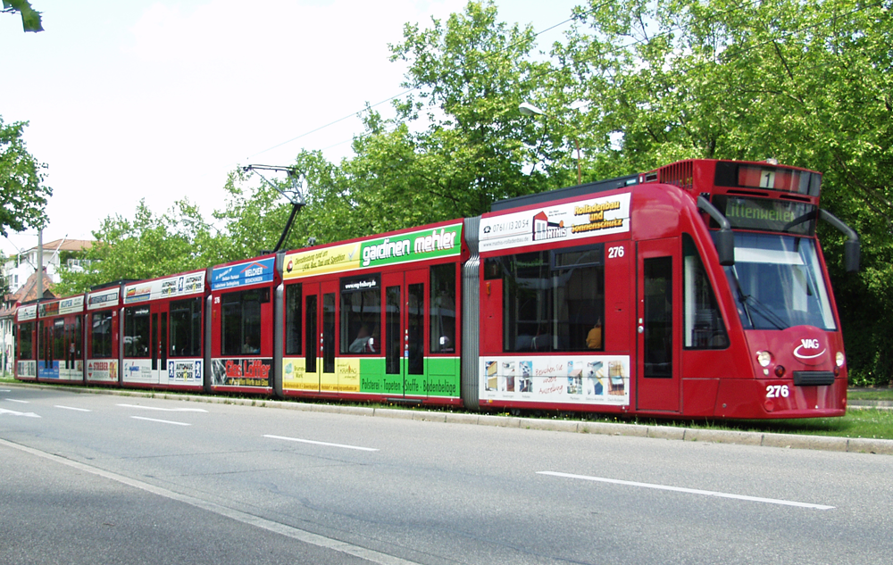

Title:Mit Foucault in der Straßenbahn 
Lang: de
Date: 2020-06-16
Category: Essay
slug: foucault-metro
Tags: 'society'
cover: assets/images/panopticon_2.jpg
Summary: Eine Spazierfahrt im mobilen Panoptikum - Welche Auswirkungen haben Fahrscheinkontrollen auf Fahrgäste und was sagen ihre Unterschiede über das zugrundeliegende Machtkonzept aus?
Status: Published

Mitunter das bekannteste Konzept des französischen Philosophen Michel Foucaults ist vermutlich seine Analyse des Panoptikons und der damit verbundene Panoptismus. Besondere Relevanz erhielt das Thema erneut durch den Umgang mit der Corona-Pandemie, wobei alte Gerüchte wieder aufgekocht wurden, dass Google und Facebook wieder einmal an etwas basteln würden, um alle zu überwachen. Auch nach der NSA-Affäre im Sommer 2013 schien kein Kommentar möglich, ohne wenigstens eine Anspielung an der Herren mit Glatze im Rollkragenpullover machen zu können. Und auch wenn sich scheinbar - unterbrochen durch einige wenige weitere Skandale - eine seltsame Ernüchterung mit dem Thema Überwachung breitgemacht hat, findet man doch immer wieder, wie eben zu Corona-Zeiten, Verweise auf das Buch 
"Überwachen und Strafen".  

Das Prinzip des von Bentham entwickelten Super-Gefängnisses ist leicht erklärt. Der Vergleich mit einer internationalen Überwachungsmaschinerie ist daher keineswegs an den Haaren herbeigezogen; die Datensammlung der amerikanischen Geheimdienste bildet ein nahezu perfektes digitales Bild des Panoptikums, in dem jede\*r jederzeit überwacht werden kann ohne es zu wissen. Der Begriff des Panoptikums trägt heute - in Anspielung an einen weiteren pessimistischen Klassiker - unweigerlich die Assoziation mit Big Brother. Während dies natürlich vollkommen richtig ist, scheint mir dabei ein wichtiger Teil der Foucault'schen Machtkonzeption verloren zu gehen. In "Überwachen und Strafen" spielt ein großer und wichtiger Teil nicht mit den bloß materiellen Techniken von, naja, Überwachen und Strafen, sondern behandelt die daraus resultierenden Machtkonzeptionen und Einflüsse, um zu zeigen, wie durchdringend verschiedene Formen der Macht sein können und sind. Das panoptische Prinzip beschränkt sich eben nicht nur auf globale Handlungsträger oder etwa den Staat als ein "kaltes Monster" (Foucault, 2004: 112), sondern ist eine Form der Machtbeziehung zwischen Subjekten, die die Möglichkeit besitzt in unsere Alltagswelt zu dringen.  

Das Ziel dieses Posts soll daher sein, wenn nicht das Panoptikum, dann eine Variation der ihm zugrundeliegenden Machtkonzeption, anhand eines relativ alltäglichen und unscheinbaren Beispiels in unserer Alltagswelt zu lokalisieren, um seinen durchdringenden Charakter als reine Machtbeziehung aufzuzeigen. Denn wenn wir die Analyse von Machtbeziehungen auf globale Akteure oder Staaten beschränken, entfällt damit die differenzierte Auseinandersetzung mit diffuseren Formen der Macht. Um Foucaults „neue Konzeption der Macht“ (Deleuze, 1992: 39) angemessen fassen zu können, greifen wir daher auf ein ganz alltägliches Beispiel zurück und bewegen uns  weg vom "grau in grau des Gefängnisses" (Deleuze, 1992: 38) und hin zum bunten, mit Werbung versehenen, mobilen Panoptikum: der Straßenbahn. 

*Straßenbahn in Freiburg im Breisgau*

## Spazierfahrt im Panoptikum

Was macht das Panoptikum aus? Zentral für Foucault ist die Herstellung einer permanenten Sichtbarkeit der Subjekte. Durch die räumliche Aufteilung im Panoptikum sind diese einem permanenten Sichtbarkeitsungleichgewicht ausgesetzt, in dem sie selbst sichtbar sind - und sich sichtbar wissen -, sie selbst aber nichts einsehen können. Man kann jederzeit überwacht werden, ohne es  zu wissen. Somit wird Macht sichergestellt, ohne dass es tatsächlich einer permanenten Überwachung benötigt - allein die Verinnerlichung der Möglichkeit, stets überwacht werden zu können ohne es zu wissen, sichert die Macht. (vgl. Foucault, 1994: 258ff.)    
Kehren wir also zurück zur Straßenbahn. In vielen deutschen Städten ist der Zutritt zur Straßenbahn, anders als in der U-Bahn, nicht räumlich beschränkt (indem man etwa nur mit einem gültigen Fahrausweis überhaupt zur Bahn gelangt). Statt einer solchen räumlichen Zugangsbeschränkung bedarf es also einer anderen Taktik, um sicherzustellen, dass nur mit gültigem Fahrausweis gefahren wird. Zwar werden die meisten Straßenbahnen per Kamera überwacht, allerdings kann man damit selbstverständlich nicht prüfen ob jemand eine Fahrkarte hat. Was also tun?

In der Deutschen Bahn finden wir noch das Konzept des/der Schaffner\*innen; Uniformierte Angestellte, die routinemäßige Fahrscheinkontrollen durchführen. Die Straßenbahn führt dieses Konzept mit einem zunächst unscheinbaren Unterschied fort: Kontrollen in der Straßenbahn finden von Personen in Zivil statt. Zwischen zwei Haltestellen fällt dann hin und wieder die überraschende wie bekannte Ansage "Fahrscheinkontrolle, Ihre Fahrscheine bitte!", womit sich augenblicklich mehrere Personen in der Bahn als Kontrolleur\*innen zu erkennen geben.    
Der Unterschied ist allerdings gravierend: Dadurch dass nicht genau identifiziert werden kann, wer Kontrolleur\*in ist, kann es theoretisch sein, dass ständig Kontrolleur\*innen in der Bahn sind. Meist warten diese nach dem Einsteigen noch einige Stationen, bevor sie die Kontrolle beginnen. Man kann sich also nie ganz sicher sein, ob man kontrolliert werden könnte. Wären die Kontrolleur\*innen eindeutig identifizierbar, könnte man rechtzeitig die Bahn verlassen, um einer Kontrolle zu entgehen. So kann man aber das Risiko nicht angemessen beurteilen.  Die Macht ist in diesem Falle also "sichtbar, aber uneinsehbar" (Foucault, 1994: 258). 

Welche Konsequenz ergibt sich daraus? Foucault beschreibt die Wirkung des Panoptikums wie folgt:

> "Die Wirkung der Überwachung >ist permanent, auch wenn ihre Durchführung sporadisch ist<; die Perfektion der Macht vermag ihre tatsächliche Ausübung überflüssig zu machen" (Foucault, 1994: 258)

Kommen wir zum Vergleich nochmal auf das Prinzip der Zutrittskontrolle zurück. Hier wird tatsächlich jede Person kontrolliert, bevor sie in die Bahn steigt. Ein Zutritt ohne gültigen Fahrausweis ist (legal) überhaupt nicht möglich. Wenn nach der Zutrittskontrolle keine weiteren sporadischen Kontrollen erfolgen, ist die Berührung mit der Macht nur punktuell auf den Moment der Zutrittskontrolle beschränkt. In der Straßenbahn ohne Zutrittskontrolle hingegen befinden sich Individuen in einem permanenten „Machtverhältnis (...), welches vom Machtausübenden unabhängig ist; die [Fahrgäste] sind Gefangene einer Machtsituation, die sie selber stützen.“ (ebd.)  
Zwar stützt sich die Fahrkartenkontrolle nicht auf eine dauerhafte Überwachung zur Verhaltensänderung - ist doch das angezielte Verhalten lediglich der Kauf einer Fahrkarte[ref]Anders wäre es hingegen, wenn die Kontrolleurinnen auch das Verhalten während der Fahrt kontrollieren würden.[/ref] - dennoch bewirkt das unsichtbare, potenziell permanente Risiko der Fahrkartenkontrolle eine Verhaltensänderung (der Kauf der Fahrkarte), „auch wenn ihre Durchführung sporadisch ist“ (ebd.).[ref]Dies bedeutet nun aber keineswegs, dass die Straßenbahnbetriebe gleich einem Big Brother sind; vielmehr jedoch dient das Beispiel dazu, Machtverhältnisse im Alltag aufzuzeigen. Foucault schreibt weiter über das Panoptikum: „Das Prinzip der Macht liegt weniger in einer Person als vielmehr in einer konzentrierten Anordnung von Körpern, Oberflächen, Lichtern und Blicken“ (Foucault, 1994: 259). Es geht hier weniger darum, die Straßenbahnbetriebe oder die Kontrolleurinnen als Macht-habende Subjekte zu entlarven. Macht ist diesen nicht eigentümlich, sondern mehr als Strategie zu verstehen, die angewandt wird.[/ref] Kurz gesagt: Nicht die *Anwesenheit* von Kontrolleur\*innen ist ausschlaggebend, sondern dass *Wissen*, dass sie anwesend sein *könnten*.

## Freiheit?

Schlussendlich offenbart diese Analyse eine eigentümliche Paradoxie - oder viel mehr ein Trugschluss - im System der Fahrkartenkontrolle: Im Vergleich zur Zutrittsbeschränkung wirkt die beschriebene Kontrolle in der Straßenbahn sozusagen liberaler; auf den ersten Blick wird den Fahrgästen mehr Freiheit und mehr Verantwortung zugesprochen, wird doch sozusagen nach dem „Honor-System“ kontrolliert. Die Fahrgäste steigen in die Bahn mit der impliziten Aufforderung, sich eine Fahrkarte gekauft zu haben - ob sie es tun oder nicht, bleibt aber ihnen überlassen.  
Gleichzeitig begeben sie sich mit dem Zustieg aber in eine asymmetrische Machtsituation, die bei einer reinen Zutrittskontrolle nicht gegeben ist. Mit anderen Worten: Es wird augenscheinlich an die Verantwortlichkeit jede\*r Einzelnen appelliert, andererseits wird eine permanente Überwachung in Kraft gesetzt - von einer lokalisierten, punktuellen Zutrittskontrolle hin zu einer räumlich getrennten, dauerhaften Überwachungssituation. 

Die bunte Straßenbahn als ökologisches Fortbewegungsmittel wird somit zum Austragungsort eines asymmetrischen Überwachungskonzepts - das mobile ökologische Panoptikum.

## Literatur

Deleuze, Gilles (1992): Foucault. Suhrkamp.

Foucault, Michel (1994): Überwachen und Strafen. Die Geburt des Gefängnisses. Suhrkamp.

Foucault, Michel (2004): Sécurité, territoire, population. Cours au Collège de France. 1977-1978. Seuil/Gallimard.

